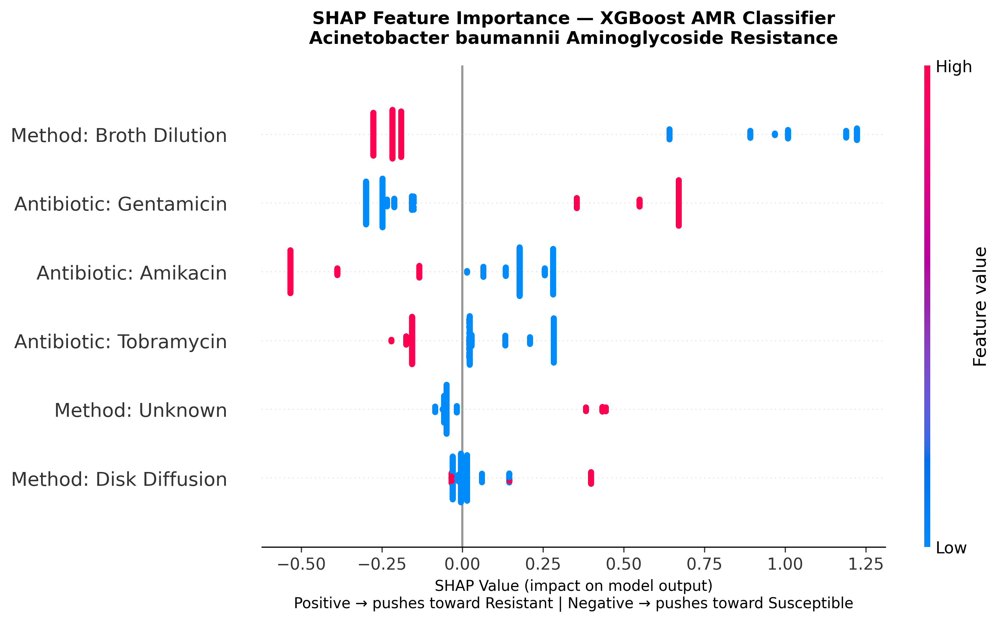
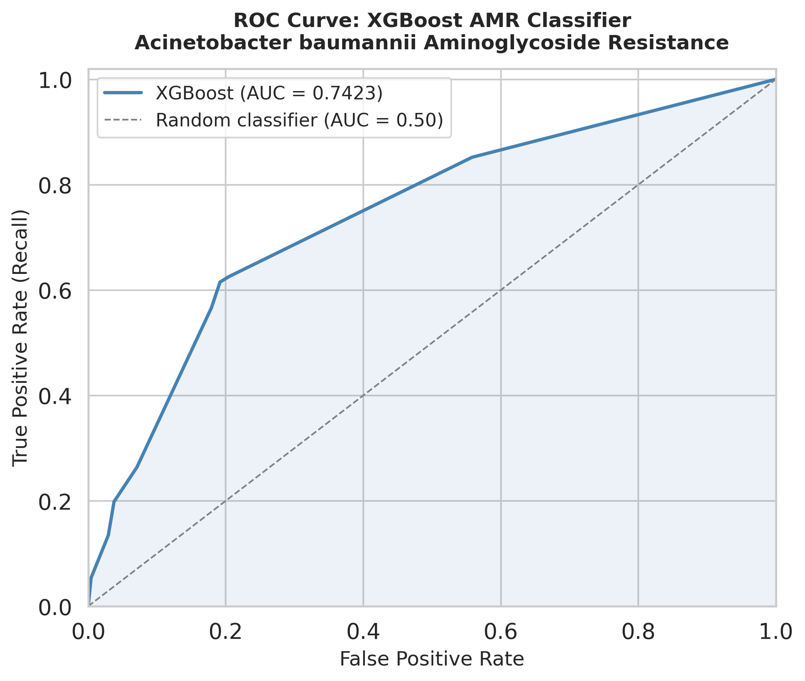

# AMR Resistance Predictor

> **XGBoost + SHAP for predicting aminoglycoside resistance in *Acinetobacter baumannii***

[](https://www.python.org/)
[](https://opensource.org/licenses/MIT)
[](https://github.com/psf/black)

---

## Overview

Antimicrobial resistance (AMR) is a global health crisis, with **Acinetobacter baumannii** emerging as a critical priority pathogen. Aminoglycoside-modifying enzymes (AMEs) like **ANT(3'')-Ia** confer resistance to clinically important antibiotics, making treatment increasingly difficult.

This project builds a **machine learning pipeline** that predicts aminoglycoside resistance from phenotypic metadata alone (drug identity and testing method), using **XGBoost** with **SHAP** interpretability. The pipeline is a feature-lean, production-style design demonstrating that drug identity and testing method alone carry meaningful predictive signal a deliberate baseline before incorporating genomic features.

> **Note on feature space:** The model uses 6 binary features (drug identity + testing method) as a principled baseline to isolate phenotypic signal. This design is intentional: tree ensembles converge on the same decision boundary given the sparse feature space, which is why XGBoost, Random Forest, and LightGBM yield identical ROC-AUC scores. XGBoost is selected for its built-in SHAP support and industry adoption.

### Why This Matters

- **Clinical relevance**: Predict resistance patterns to guide antibiotic selection
- **Interpretability**: SHAP reveals *why* the model makes predictions, not just what it predicts
- **Reproducibility**: Full pipeline from data download to model interpretation, config-driven and containerised
- **Biological context**: Directly relevant to AME-mediated resistance mechanisms studied in companion structural biology work (see [Related Work](#related-work))
- **Transferability**: Demonstrates a production-ready tabular ML pipeline applicable to any binary classification problem with phenotypic or observational data

---

## Key Results

| Metric | Value | 95% Confidence Interval |
|--------|-------|-------------------------|
| **ROC-AUC** | 0.742 | [0.706, 0.777] |
| **F1 Score** | 0.820 | — |
| **Accuracy** | 0.67 | — |

### Feature Importance (SHAP)



**Gentamicin** is the strongest predictor of resistance, consistent with the prevalence of ANT(3'')-Ia enzymes in *A. baumannii*. Amikacin shows weaker signal, reflecting its structural modifications that evade common AME-mediated resistance mechanisms.

### Model Performance



---

## Methods

### Data Source

- **Database**: BV-BRC (Bacterial and Viral Bioinformatics Resource Center)
- **Organism**: *Acinetobacter baumannii* (NCBI Taxon ID: 470)
- **Antibiotics**: Amikacin, Gentamicin, Tobramycin
- **Records**: 4,172 laboratory-confirmed phenotypes
- **Filtered to**: Laboratory-confirmed evidence only

### Feature Engineering

| Feature Type | Features Created |
|--------------|------------------|
| Drug identity | One-hot encoded antibiotics (3) |
| Testing method | One-hot encoded methods (3) |
| **Total features** | **6 binary features** |

### Models Evaluated

| Model | ROC-AUC | F1 | Training Time |
|-------|---------|----|---------------|
| **XGBoost** | 0.7423 | 0.8204 | 0.50s |
| **Random Forest** | 0.7423 | 0.8204 | 0.78s |
| **LightGBM** | 0.7423 | 0.8204 | 0.29s |
| **Logistic Regression** | 0.7372 | 0.7323 | 0.17s |

All three tree ensemble models converge on the same ROC-AUC and F1 given the sparse 6-feature binary input space, this is expected and confirms that the decision boundary is fully captured at this feature resolution. XGBoost is selected as the primary model for its native SHAP integration and widespread industry adoption for tabular data.

### Advanced Validation

| Method | Result |
|--------|--------|
| **Leave-One-Group-Out CV** | ROC-AUC: 0.887 ± 0.231 |
| **Bootstrap (95% CI)** | [0.706, 0.777] |
| **XGBoost vs Logistic Regression** | p = 0.922 (not significant) |

---

## Installation

### Prerequisites

- Python 3.11+
- Conda (recommended) or pip

### Setup with Conda

```bash
# Clone the repository
git clone https://github.com/menzisk/amr-resistance-predictor.git
cd amr-resistance-predictor

# Create and activate environment
conda env create -f environment.yml
conda activate amr-predictor
```

### Setup with pip

```bash
pip install -r requirements.txt
```

### Run the pipeline

```bash
python src/train.py --config config.yaml
```

---

## Project Structure

```
amr-resistance-predictor/
├── src/                  # Pipeline scripts
├── outputs/
│   └── figures/          # SHAP plots, ROC curves, model outputs
├── config.yaml           # Centralised pipeline configuration
├── environment.yml       # Conda environment
├── requirements.txt      # pip dependencies
└── README.md
```

---

## Related Work

This repository is part of a broader computational AMR research portfolio focused on **ANT(3'')-Ia aminoglycoside nucleotidyltransferase**, the enzyme family responsible for the resistance phenotypes modelled here.

| Repository | Description |
|------------|-------------|
| **amr-resistance-predictor** (this repo) | ML pipeline: XGBoost + SHAP on phenotypic resistance data |
| **ANT-MDS-Analysis** *(coming soon)* | MD simulation analysis: dPCA, FEL, DCCM, MM/GBSA for AbANT and SaANT |
| **ANT-MDS-Database** *(coming soon)* | Curated simulation data: 14 systems (7 ligands × 2 enzymes), trajectories and configs |

The structural biology work in ANT-MDS-Analysis directly contextualises the resistance mechanisms driving the SHAP signal observed here, particularly the Gentamicin signal, which is consistent with ANT(3'')-Ia substrate specificity and the enzyme's conformational dynamics under aminoglycoside binding.

---

## Citation

If you use this pipeline or data in your work, please cite:

```
Sikakane, M. et al. (in preparation). Computational characterisation of ANT(3'')-Ia
aminoglycoside resistance enzymes from Acinetobacter baumannii and Staphylococcus aureus.
```

---

## License

MIT License — see [LICENSE](LICENSE) for details.

